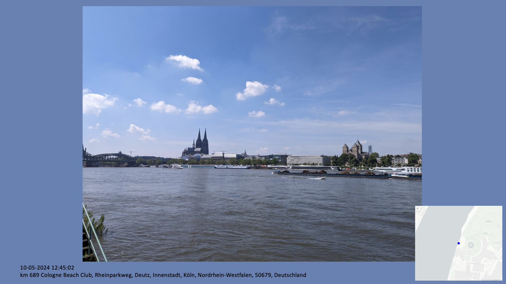

# Photos to Powerpoint
Creates a PowerPoint presentation of photos in addtion to some meta data like 
- ISO, exposure or aperture.
- Datetime when photo was taken
- Position data (city, land, state etc)

# Installation
pip install -r requirements.txt

# Example
Example for one slide.

